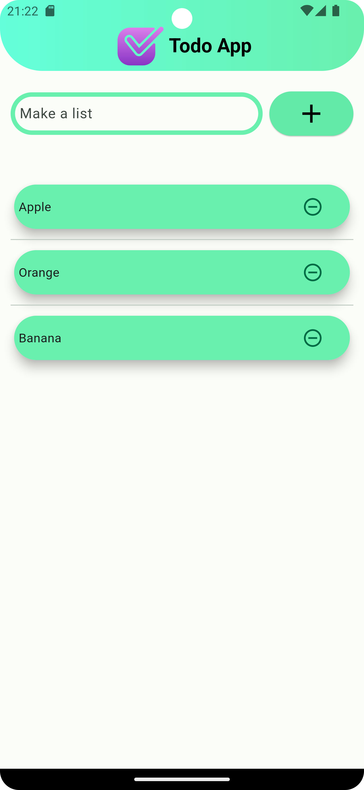
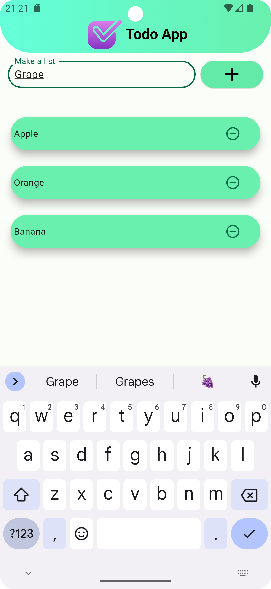

# Simple Todo App in Flutter
Get things done effortlessly with our intuitive todo app.
This is a simple Todo app built using Flutter. It allows users to create, read, update, and delete tasks in a convenient manner.

## Features

- Add new tasks with a title and description
- Mark tasks as completed
- Edit existing tasks
- Delete tasks
- View list of tasks

## Installation

1. Clone the repository:

    ```bash
   git clone https://github.com/SavrinAlif/Todo-App.git

2. Navigate into the project directory:

    ```bash
   cd todo_app_flutter

3. Install dependencies:

    ```bash
   flutter pub get

4. Run the app:

    ```bash
   flutter run

## Screenshots




## Dependencies

This project uses the following dependencies:

- [provider](https://pub.dev/packages/provider) - State management
- [sqflite](https://pub.dev/packages/sqflite) - SQLite integration for local database storage
- [path_provider](https://pub.dev/packages/path_provider) - For accessing the device's file system paths
- [intl](https://pub.dev/packages/intl) - Internationalization and localization support

## Contributing

Contributions are welcome! If you find any issues or have suggestions, feel free to open an issue or create a pull request.

## License

Will be added later